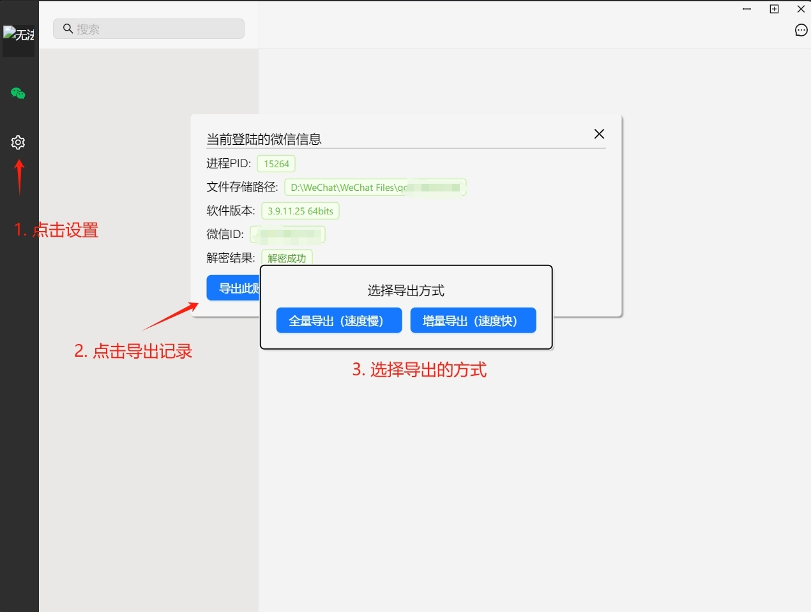

# wechatDataBackup
PC微信聊天记录数据导出工具

[](https://github.com/git-jiadong/wechatDataBackup/stargazers)
[](https://github.com/git-jiadong/wechatDataBackup/releases)
[](https://github.com/git-jiadong/wechatDataBackup/releases)
[](https://github.com/git-jiadong/wechatDataBackup/commits/main)
[](https://github.com/git-jiadong/wechatDataBackup)
[](https://github.com/git-jiadong/wechatDataBackup)
[](https://github.com/git-jiadong/wechatDataBackup/blob/main/LICENSE)

* 基于wails开发 + React前端，实现PC端微信聊天记录一键导出功能。
* 导出后数据可以做永久化保存，即使微信停止支持，聊天记录也可以随时查看。
* 前端界面尽量与微信界面保持一致，减少使用成本。
* 理论上支持所有Windows 32/64位微信版本。

效果图如下：


## 演示视频
[演示视频](https://www.bilibili.com/video/BV1bPH1eWEEy/?share_source=copy_web&vd_source=b5cfa9258a9ad9900a00e9c1ce3cb4b6)
## 使用方法
1. 下载release可执行文件直接打开 国内朋友也可以使用 [网盘下载](https://pan.quark.cn/s/fa157b13e762)
2. 下载源码自行编译可执行文件 [安装wails环境](https://wails.io/zh-Hans/docs/gettingstarted/installation)

```shell
git clone https://github.com/git-jiadong/wechatDataBackup.git
cd wechatDataBackup
wails build
```

编译成功后在可执行二进制文件路径`build\bin\wechatDataBackup.exe`

如果编译错误可能是没有gcc环境导致的，可以安装 [tdm-gcc](https://jmeubank.github.io/tdm-gcc/) 后在尝试。

3. 导出聊天记录
电脑登陆微信，然后打开`wechatDataBackup.exe`后按照如图提示导出


## 功能

本项目目前的规划与实现进度：
- [x] 支持图片消息
- [x] 支持视频消息
- [x] 支持链接消息
- [x] 支持语音消息
- [x] 支持文件消息
- [x] 支持名片消息
- [x] 支持定位消息
- [x] 支持视频/语音通话消息
- [x] 支持QQ音乐消息
- [x] 支持第三方视频软件分享消息
- [x] 支持分享表情集消息
- [x] 支持小程序消息
- [x] 支持视频号/直播消息
- [x] 支持转账消息
- [x] 支持腾讯游戏分享消息
- [x] 支持原始表情显示
- [x] 支持按类型检索
- [x] 支持日期检索
- [x] 支持按群成员检索
- [x] 支持增量式导出
- [x] 多开账号选择导出
- [x] 多开账号数据切换
- [x] 头像使用本地头像
- [ ] 支持更多消息类型显示
- [x] 图片查看器重绘
- [x] 支持会话导出分享
- [x] 支持自动定位到最后浏览位置
- [x] 支持书签功能
- [x] 支持单聊会话对话人位置调换功能
- [ ] 实现表情预先下载（实现完全离线查看）
- [ ] 聊天报告
- [ ] AI本地模型应用
- [ ] 导出数据本地加密
- ...
如果遇到什么问题，或者有更好的建议与优化点欢迎给作者提 [ISSUE](https://github.com/git-jiadong/wechatDataBackup/issues)


### 常见问题
**Q: 支持手机端的聊天记录备份吗？**<br>
A: 手机端可以使用聊天数据迁移功能，将手机的数据迁移到电脑后再将数据导出。 [微信迁移聊天记录功能](https://www.bilibili.com/opus/974795819172495381)<br>
**Q: 导出后界面是空白的、导出的数据比PC微信里面看到的少,数据不完整**<br>
A: 这是由于可能数据存在于内存中还没有回写到磁盘导致的，退出微信时会将内存的数据全部回写到磁盘，导出数据时最好退出重新登陆一次微信，保证数据都在磁盘中再导出即可。<br>
**Q: 有些图片、视频打不开**<br>
A: 这是电脑端微信没有点开过这个消息，默认只加载了预览图而已，如果手机有打开过可以把手机的记录迁移到电脑，迁移后重新退出登陆一次微信导出即可。<br>
**Q: Win7电脑不能使用**<br>
A: Win7电脑需要安装WebView2运行时才能正常使用。github release版本做了Windows版本限制，[Win7用户请安装专属的版本](https://pan.quark.cn/s/fa157b13e762)
## Star History

[](https://star-history.com/?utm_source=bestxtools.com#git-jiadong/wechatDataBackup&Date)

## 免责声明
**⚠️ 本项目仅供学习、研究使用，严禁商业使用**<br/>
**⚠️ 用于网络安全用途的，请确保在国家法律法规下使用**<br/>
**⚠️ 本项目完全免费，问你要钱的都是骗子**<br/>
**⚠️ 使用本项目初衷是作者研究微信数据库的运行使用，您使用本软件导致的后果，包含但不限于数据损坏，记录丢失等问题，作者不承担相关责任。**<br/>
**⚠️ 因软件特殊性质，请在使用时获得微信账号所有人授权，你当确保不侵犯他人个人隐私权，后果自行承担**<br/>

## 前端代码
由于前端代码不成熟，前端界面代码暂时不公开。

## 参考/引用
- 微信数据库解密和数据库的使用 [PyWxDump](https://github.com/xaoyaoo/PyWxDump/tree/master)
- silk语音消息解码 [silk-v3-decoder](https://github.com/kn007/silk-v3-decoder)
- PCM转MP3 [lame](https://github.com/viert/lame.git)
- Dat图片解码 [wechatDatDecode](https://github.com/liuggchen/wechatDatDecode)

## 交流/讨论
